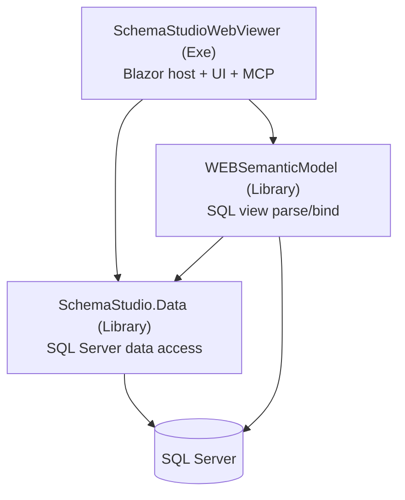

# SchemaStudioWebViewer - Architecture (general)

> Generated from the AIMonitor solution index (3 projects) on 2026-07-23. ASCII-only (incl. mermaid).
> Level: **orientation only.** Per-project detail lives in `Docs/<Project>/Architecture.md`; this file is the map.

## What it is

A **Blazor Server** web app (net9.0, `SchemaStudioWebViewer.csproj`, OutputType `Exe`) for browsing and
authoring SQL Server schema/view metadata. UI is **Radzen** components. The app also **hosts its own MCP
server** (`Mcp` config section + `McpTools/`) exposing a schema catalog to agents. Auth is a lightweight
gate (stub), with a **Kiosk** mode for unauthenticated demo display.

Entry point: [Program.cs](Program.cs) at the solution root. Runtime config: [appsettings.json](appsettings.json).

## Project dependency map

## Projects (dependency order, leaf to root)

| Project | Type | Role | Detail doc |
|---|---|---|---|
| **SchemaStudio.Data** | Library | Data access: `Models/` DTOs, `Repositories/` (sync + async), `Sql/` raw scripts. SQL Server (Dapper + SqlClient). | [Docs/SchemaStudio.Data](SchemaStudio.Data/Architecture.md) |
| **SchemaStudioWebViewer.WEBSemanticModel** | Library | SQL semantic model: parse view SQL -> bound columns/dependencies (`ViewParsingService` / `QueryOrchestrator`). References `SchemaStudio.Data.Models`; reads view SQL from SQL Server directly. | [Docs/WEBSemanticModel](WEBSemanticModel/Architecture.md) |
| **SchemaStudioWebViewer** | **Exe** | Blazor host + UI + config + embedded MCP. Depends on both libraries above. | [Docs/SchemaStudioWebViewer](SchemaStudioWebViewer/Architecture.md) |

## Configuration (the pattern to know)

`appsettings.json` is **never read directly** by feature code. [AppConfig.cs](AppConfig/AppConfig.cs) reads it
once into the static `AppConfig.Current.<Section>.<Property>`. Full key-by-key reference (and the login-button
example): **[Docs/Configuration.md](Configuration.md)**.

Quick exemplar - the login button is `Auth:ShowAuthButton` ([Home.razor:115](Components/Pages/Home.razor#L115)),
bound at [AppConfig.cs:46](AppConfig/AppConfig.cs#L46) where it defaults to `true`; set it `false` to hide. (Not `Kiosk:ShowLoginLink`.)

## Runtime flow (high level)

1. `Program.cs` builds the Blazor Server host, binds `AppConfig`, registers repositories + semantic-model
   services, and (if `Mcp:Enabled`) mounts the MCP endpoint at `Mcp:BaseRoute`.
2. Browser hits a page under `Components/Pages/`; auth/kiosk gates (`AppConfig.Current.Auth/.Kiosk`) decide access.
3. Pages call **app `Repositories/`** (live SMO + read-only) and **`SchemaStudio.Data` repos** -> SQL Server.
4. View SQL runs through **WEBSemanticModel** (`ViewParsingService` -> `QueryOrchestrator` -> parse/bind) to
   produce bound columns/dependencies shown in the UI (e.g. Manage Views Next column editing).
5. Agents can hit the embedded MCP server (`McpTools/SchemaCatalogMcpTools`) for the schema catalog.
6. Schema-object **relationships** are authored in **Manage Databases**
   (`Components/Pages/ManageDatabases/DatabaseRelationshipsPanel.razor`) and consumed by the **Domain Object
   Modeler** (`DomainObjectModeler.LoadSourceDatabaseRelationshipsAsync`); they are persisted by
   `SchemaStudio.Data`'s `DatabaseRelationshipRepository` (+ `Sql/DatabaseRelationships_*.sql`). See
   [Docs/SchemaStudio.Data](SchemaStudio.Data/Architecture.md) for the persistence detail.

## Documentation in this repo

- **`Docs/`** (this tree) - generated architecture map + per-project + config reference. Regenerated from the index; do not hand-patch.
- **Per-feature `README.md`** inside component folders - deeper, hand-authored, present-tense specs:
  `Components/ColumnReconciliation/README.md`, `Components/Dialogs/README.md`,
  `Components/Pages/ManageViewsNext/README.md`, `Components/Pages/DomainObjectModeler/README.md`.
- **`TODO.md`** files (root and `Components/ColumnReconciliation/`) - future/speculative work, kept separate from the READMEs.

## Removed since the 2026-07-07 generation

- **`SchemaStudio.AIHelpers` project removed.** The `[FileVersion]`/`[AIFileContext]` attribute library no longer
  exists (no `.csproj`, no source, no remaining attribute references). Its per-project doc
  `Docs/SchemaStudio.AIHelpers/Architecture.md` is intentionally blanked. Project count: 4 -> 3.
- **`BaseViewGenerator` page removed** (route `/base-view-generator`) - only a stale `obj/Release` artifact remains.

## Notes

- All C# here is **AI-generated**; the only hand-edited surface is `appsettings.json` (+ `.Development.json`).
- Keep `Docs/` files ASCII-only (including mermaid): the watched-source save path corrupts non-ASCII punctuation to `?`.

## Refreshing this doc

Generated artifact. Regenerate against the index after confirming it is current (`get_monitor_status`:
`staleFileCount` 0): projects from `get_solution_index_tree` / the `.csproj` set; per-project files from
`query_solution_index(scope: "folder")` (not a whole-solution glob - it truncates); config from `AppConfig.cs`;
usage via `find_indexed_references`. Link existing `README.md`/`TODO.md`, do not duplicate them.
