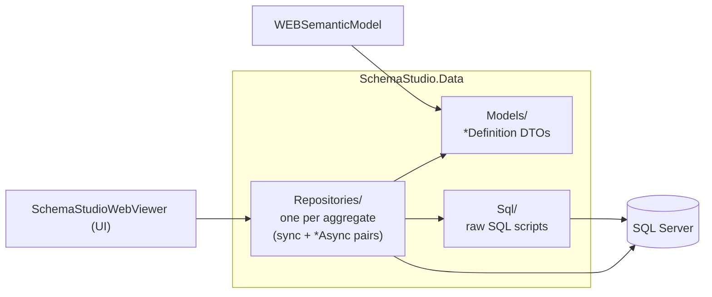

<!-- GENERATED from the AIMonitor solution index on 2026-07-23 (re-verified against source). Regenerate, do not hand-patch. Source: project SchemaStudio.Data. ASCII-only (incl. mermaid). -->

# SchemaStudio.Data - Architecture (project detail)

> Component-level detail for the `SchemaStudio.Data` project. The solution map is [../Architecture.md](../Architecture.md).

## Role

The **data-access library** (net9.0, Library). No UI, no business rules - it reads/writes SQL Server schema
metadata and returns typed `*Definition`/DTO objects. Consumed by the `SchemaStudioWebViewer` web app and by
`WEBSemanticModel` (which uses its `Models/` DTOs). Backed by `ConnectionStrings:DefaultConnection` (see the
solution map / config reference). Packages: `Dapper`, `Microsoft.Data.SqlClient`.

## Layering

## Layout

- **`Models/`** - typed rows and DTOs (no behavior):
  - `DatabaseDefinition`, `DatabaseDomainDefinition`, `DatabaseRelationshipDefinition`
  - `SchemaObjectDefinition`, `SchemaObjectColumnDefinition`, `SchemaObjectDtos`
  - `SourceViewDefinition`, `SqlObjectDependency`
- **`Repositories/`** - one repository per aggregate, most with a **sync + `*AsyncRepository` pair**:
  - Databases: `DatabaseRepository`
  - Domains: `DatabaseDomainRepository` / `DatabaseDomainAsyncRepository`
  - Relationships: `DatabaseRelationshipRepository`
  - Schema objects: `SchemaObjectRepository`, `SchemaObjectColumnRepository`
  - Source views: `SourceViewRepository` / `SourceViewAsyncRepository`
  - Dependencies: `SqlObjectDependencyRepository`
- **`Sql/`** - **raw SQL scripts** the repositories execute (not an ORM):
  - `SchemaObjectColumn_UpsertFull.sql` - full column-metadata upsert (incl. the business name/description edited in Manage Views Next).
  - `SchemaObject_CompositionDefinitionJson.sql` - composition/definition JSON read.
  - `DatabaseRelationships_Create.sql`, `DatabaseRelationships_Rebuild_JoinExpression.sql` - relationship create/rebuild.

## Patterns to know

- **Raw SQL, not an ORM.** Queries live in `Sql/` scripts (and/or inline in repos) executed against SQL Server
  via Dapper / `Microsoft.Data.SqlClient`. There is no migrations framework - schema is external. When changing
  persisted shape, the `Sql/` upsert is the write path to check (e.g. column business-value edits go through
  `SchemaObjectColumn_UpsertFull.sql`).
- **Sync/async pairing:** prefer the `*AsyncRepository` from Blazor UI paths; sync variants exist for
  non-async callers. When changing a query, check whether both variants need the change.
- **Definition objects are DTOs**, not domain models - copy semantics matter. Adding a field to a `*Definition`
  means updating any clone/copy path that projects it (a known slice hazard here).
- **Relationships were recently reworked** ("Relationship System Cleanup", "DatabaseDefinition.cs relationship
  follow up"). `DatabaseRelationshipDefinition` + `DatabaseRelationshipRepository` + the two
  `DatabaseRelationships_*.sql` scripts are the persistence surface; the UI lives in the web app
  (`ManageDatabases/DatabaseRelationshipsPanel.razor`).

## Where it is used (source-verified, 2026-07-23)

Direct symbol references:

- `DatabaseRepository` -> `Components/Pages/DatabaseDomainTest.razor.cs`.
- `DatabaseDomainRepository` -> `Components/Pages/ManageDatabases.razor`, `DatabaseDomainTest.razor.cs`.
- `Models/` DTOs (`SchemaStudio.Data.Models`) -> also consumed by `WEBSemanticModel`
  (`Services/ViewParsingService.cs`, `Model/ExportMappers.cs`).

**No direct symbol references** appear for the `*AsyncRepository` variants, `DatabaseRelationshipRepository`,
`SchemaObjectRepository`, `SchemaObjectColumnRepository`, `SourceViewRepository`, or
`SqlObjectDependencyRepository`. **This does not mean unused.** They are resolved through **DI registration in
`Program.cs` and `@inject` in Razor**, which the C# *symbol* reference index does not capture. Confirm via
`Program.cs` service registrations and page `@inject` directives before treating any as dead.

## Refresh

Regenerate after confirming the index is current: enumerate files via `query_solution_index(scope: "folder")`
on `SchemaStudio.Data/` (include the `Sql/` folder - a whole-solution glob truncates and can miss it); usage via
`find_indexed_references`. Keep ASCII-only, including mermaid.
