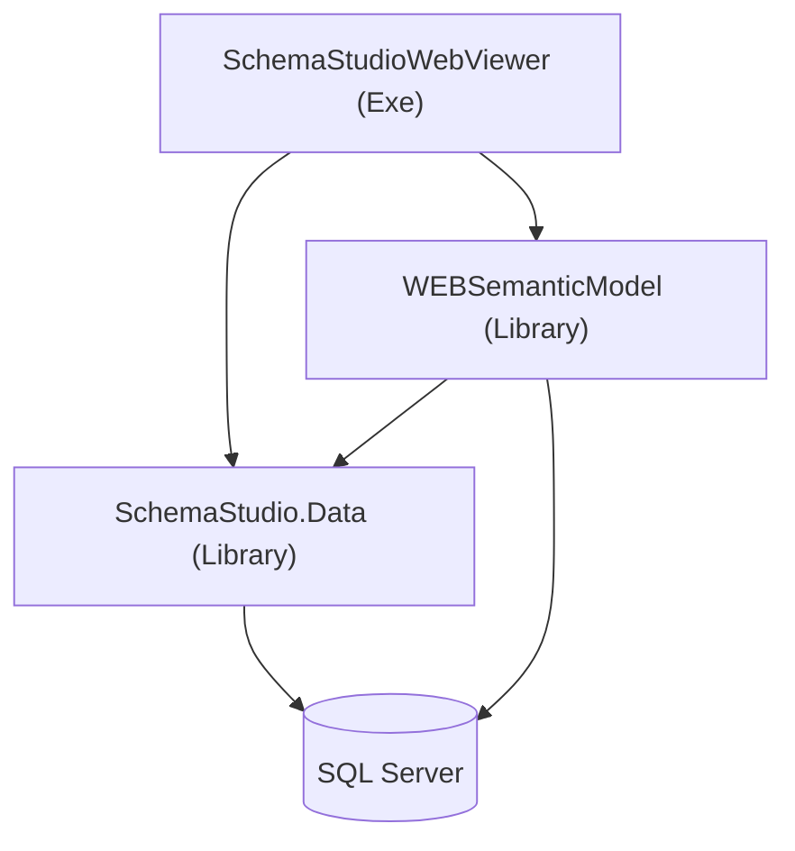
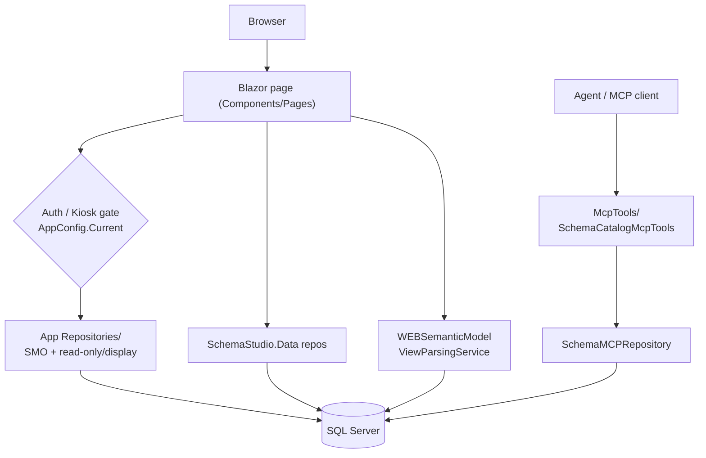

<!-- GENERATED from the AIMonitor solution index on 2026-07-23 (staleFileCount 0; 3 projects / 110 docs / 2238 symbols / 0 diagnostics). Regenerate, do not hand-patch. Source: project SchemaStudioWebViewer (root project). ASCII-only (incl. mermaid). -->

# SchemaStudioWebViewer (web app) - Architecture (project detail)

> Component-level detail for the root Blazor project. Solution map: [../Architecture.md](../Architecture.md).
> This project's files live at the **solution root** (not a subfolder), so paths below are relative to root.

## Role

The **Blazor Server host + UI + config + embedded MCP** (net9.0, Exe). Entry point
[../../Program.cs](../../Program.cs). Depends on `SchemaStudio.Data` (data) and `WEBSemanticModel` (view parsing).
UI is Radzen. Key packages: `Radzen.Blazor`, `Microsoft.SqlServer.SqlManagementObjects` (SMO), `Dapper`,
`Microsoft.Data.SqlClient`, `Microsoft.SqlServer.TransactSql.ScriptDom`, `ModelContextProtocol(.AspNetCore)`.

## Diagrams

Project dependencies (this project is the root Exe):

Runtime request flow:

## Feature pages (`Components/Pages/`)

Larger features use **partial classes** (`.Sql.cs`, `.Models.cs`, `.Selection.cs`, etc.) to split one page
across files. Routes below are the actual `@page` directives in source. Several feature folders carry their own
`README.md` (linked below) - read those for deep detail.

| Area (route) | What it does |
|---|---|
| `ManageViewsNext` (`/manage-views`, `/manage-views-next`) | The live "Manage Views" page. Per-view **column editor**: edit each column's `BusinessName` + `BusinessDescription`; `Review Merge` opens column reconciliation. Parts: `.razor(.cs/.css)`, `.Columns.cs`, `.Parser.cs`, `.Selection.cs`. See [ManageViewsNext/README](../../Components/Pages/ManageViewsNext/README.md). |
| `DomainObjectModeler` (`/domain-object-modeler`) | Model domain objects over schema (joins/selection/SQL). Partial-class heavy: `.Joins/.Models/.Sql/.Definition/.Selection/.razor.cs`. See [DomainObjectModeler/README](../../Components/Pages/DomainObjectModeler/README.md). |
| `DomainObjectEditor` (`/domain-object-editor`) | Edit domain objects; CTE editors (`CteFieldParser`, `CteSelectionSessionEditor`, `CteSelectionPresentationEditor`). |
| `BaseViewCreator` (`/base-view-creator`) | Create base views. Parts: `.razor(.cs)`, `.Metadata.cs`, `.Sql.cs`, `BaseViewCreatorSelectionEngine`, `BaseViewCreatorState`, `UdtTypeResolver`, and `BaseViewCreatorMetadataDialog`. |
| `ManageDatabases` (`/manage-databases`) | Databases page + `ManageDatabases/DatabaseRelationshipsPanel` (table-relationships UI - see relationship-system note below). |
| `ParserLab` (`/parser-lab`) | Parser test area - exercise `WEBSemanticModel` parsing directly. |
| `ToolLab` (`/tool-lab`) | Utility/experimental tools. |
| `Home` (`/`, `/kiosk`, `/explore`), `About` (`/about`) | `Home` backs the default, kiosk, and explore entry routes (auth-gated login button - see config reference). `About` is the info page. |
| `DatabaseDomainTest` (`/database-domain-test`), `Counter` (`/counter`), `Weather` (`/weather`), `Error` (`/Error`), `SQLHighlighter` (no `@page`) | Test/utility/framework pages and components. |

Support UI:

- `Components/Layout/` - `MainLayout`, `NavMenu`.
- `Components/Dialogs/` - modals: `ColumnDetailsDialog`, `ColumnMergeReviewDialog`, `DynamicDetailForm`,
  `ErrorDetailsDialog`, `ParsedDependenciesDialog`, `ResolvedDependencyChainDialog`, `SqlObjectDependenciesDialog`,
  `UnmergedParserChangesDialog`, `ViewSQLDialog`. See [Dialogs/README](../../Components/Dialogs/README.md).
- `Components/HelpSystem/` - `HelpDialog`, `HelpEditor`.
- `Components/ColumnReconciliation/` - `ColumnReconciliationDialog`, `ReconciliationStatusEvaluator`. See
  [ColumnReconciliation/README](../../Components/ColumnReconciliation/README.md) and its `TODO.md`.

## Non-UI app code

- **`Repositories/`** (app-level, distinct from `SchemaStudio.Data`): `TableSchemaSmoRepository` (SQL Server
  **SMO** live schema), `ReadOnlyDatabaseRepository`, `ReadOnlySchemaObjectRepository`,
  `ReadOnlyViewDefinitionRepository`, `SchemaMCPRepository`, `TableDisplayColumnPolicy`.
- **`Models/`** - view/display models bridging Data DTOs to UI: `DisplaySchemaObject`, `SchemaObjectModel`,
  `SchemaObjectColumnModel`, `DatabaseModel`, `DatabaseDomainModel`, `DisplayAttributes`, `HelpSubject`,
  `ViewDefinitionResult`, `SQLViewMock`.
- **`McpTools/`** - `SchemaCatalogMcpTools`: schema-catalog tool surface exposed to agents via the embedded MCP server.
- **`AppConfig/`** - config binding (see [../Configuration.md](../Configuration.md)).
- **`Utils/`** - `AttributeService`, `ReflectionUtils`.

## Resolved usage (index + source-verified, 2026-07-23)

- App read-only repositories (`ReadOnlyDatabaseRepository`, `ReadOnlySchemaObjectRepository`,
  `ReadOnlyViewDefinitionRepository`) and the SMO/display layer (`TableSchemaSmoRepository`,
  `TableDisplayColumnPolicy`) are consumed across multiple surfaces - `Home.razor`, `DomainObjectModeler`
  (`.razor` + `.Sql.cs`), `DomainObjectEditor.razor`, `BaseViewCreator.razor.cs`, and
  `ManageDatabases/DatabaseRelationshipsPanel.razor` - and registered in `Program.cs`.
- `SchemaMCPRepository` -> consumed by `McpTools/SchemaCatalogMcpTools.cs` (constructor injection at :16 and
  `SchemaMCPRepository.CleanSqlDefinition` at :190).
- `SchemaCatalogMcpTools` -> wired in `Program.cs`: `.WithTools<SchemaCatalogMcpTools>()` (:33),
  `AddScoped<SchemaCatalogMcpTools>()` (:43), and an endpoint handler parameter (:105).

## Relationship system (recent work)

`ManageDatabases/DatabaseRelationshipsPanel.razor` is the root-project UI for table relationships. Recent commits
("Relationship System Cleanup Take 1", "DatabaseDefinition.cs relationship follow up") reworked the underlying
relationship model, which lives in `SchemaStudio.Data` (`DatabaseDefinition`, `DatabaseRelationshipDefinition`,
`DatabaseRelationshipRepository`) - see the Data project's [Architecture](../SchemaStudio.Data/Architecture.md).
Treat the panel here as the presentation surface over that model.

## Patterns to know

- **Partial-class pages:** big pages (`DomainObjectModeler`, `ManageViewsNext`, `BaseViewCreator`) spread logic
  across sibling `.cs` files - find all parts before editing (`find_indexed_symbols` / grep the folder).
- **Two repository layers:** app `Repositories/` (live SMO + read-only/display) sit above `SchemaStudio.Data`
  repos (persisted definitions). Know which layer you are in.
- **Per-folder READMEs exist** for the gnarly features - prefer reading/refreshing those over restating them here.
- **Auth/kiosk gating** is config-driven via `AppConfig.Current` - see the config reference. `Home` serves the
  `/`, `/kiosk`, and `/explore` routes.

## Changes since the 2026-07-07 generation

- **`BaseViewGenerator` (`/base-view-generator`) removed** - the page no longer exists in source (only a stale
  `obj/Release` scoped-css artifact remains). Dropped from the page table.
- **`SchemaStudio.AIHelpers` project removed** - the `[FileVersion]`/`[AIFileContext]` attribute library is gone;
  its per-project doc is blanked. The solution is now 3 projects.
- `BaseViewCreator` gained `BaseViewCreatorState` and `UdtTypeResolver`.
- `DomainObjectEditor` and `ToolLab` now carry explicit routes (`/domain-object-editor`, `/tool-lab`); `Home`
  now also serves `/kiosk` and `/explore`.
- Read-only / SMO repository usage broadened well beyond `Home.razor` (see Resolved usage).

## Refresh

Regenerate: confirm the index is current first (`get_monitor_status`: `staleFileCount` 0); enumerate files per
folder (a whole-solution index glob truncates); confirm `@page` routes by grepping `Components/Pages/**/*.razor`;
link existing `Components/**/README.md` rather than duplicating them; verify usage via `find_indexed_references`
or grep. Keep ASCII-only, including mermaid (the watched-source save path corrupts non-ASCII punctuation to `?`).
