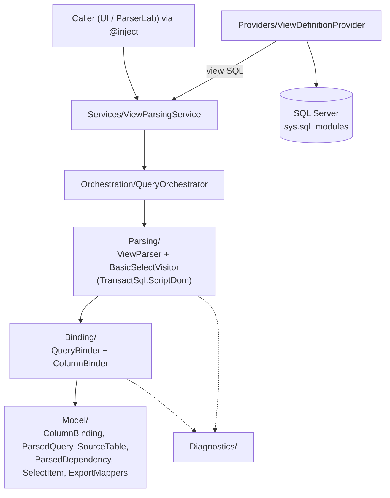

<!-- GENERATED from the AIMonitor solution index on 2026-07-23 (re-verified against source). Regenerate, do not hand-patch. Source: project SchemaStudioWebViewer.WEBSemanticModel. ASCII-only (incl. mermaid). -->

# WEBSemanticModel - Architecture (project detail)

> Component-level detail for the `SchemaStudioWebViewer.WEBSemanticModel` project. Solution map: [../Architecture.md](../Architecture.md).

## Role

The **SQL semantic model** (net9.0, Library). It turns raw SQL **view definitions** into a bound, structured
model - parsed columns, source tables, dependencies, and view metadata - that the UI displays and reasons about.

The **core pipeline** (`Parsing/`, `Binding/`, `Model/`) is pure logic over SQL text, using
`Microsoft.SqlServer.TransactSql.ScriptDom` to parse T-SQL. It references `SchemaStudio.Data.Models` for shared
definition/DTO types (used by `ViewParsingService` and `ExportMappers`).

> Correction (2026-07-23): an earlier version of this doc said the project has "no database access." That is
> **wrong**. `Providers/ViewDefinitionProvider` opens a `Microsoft.Data.SqlClient` `SqlConnection` and reads
> view definitions directly from `sys.sql_modules` (with an in-memory cache). The parse/bind core stays pure;
> the provider is the DB-touching edge.

## Pipeline

## Full layout

- **`Parsing/`** - `ViewParser`, `BasicSelectVisitor` (walks the SELECT), `ViewMetaDataBinder` (view-level metadata), `QueryFormatter`, `TokenHelpers`.
- **`Binding/`** - `QueryBinder`, `ColumnBinder`: map parsed elements to model bindings.
- **`Model/`** - `ColumnBinding`, `ViewSourcedColumnDefinition`, `SourceTable`, `ParsedDependency`, `SelectItem`, `ParsedQuery`, `Enums`, `ExportMappers` (projection to export shapes).
- **`Orchestration/`** - `QueryOrchestrator`: coordinates parse -> bind for a query/view.
- **`Services/`** - `ViewParsingService`: the orchestration entry point callers use.
- **`Providers/`** - `IViewDefinitionProvider` + `ViewDefinitionProvider`: supplies view SQL. The implementation
  reads directly from SQL Server (`sys.sql_modules` / `sys.objects` / `sys.schemas`), caches by
  `db.schema.view`, normalizes line endings to CRLF, and walks dependency chains.
- **`Diagnostics/`** - `Diagnostics` (`IQueryLogger` / `NullQueryLogger`): parse/bind/fetch diagnostics surface.

## Patterns to know

- **Entry point is `ViewParsingService`**; internally `QueryOrchestrator` drives the parse->bind sequence. Do
  not call the parsers/binders directly from UI - go through the service.
- **`IViewDefinitionProvider` is the input seam** - the parse/bind core does not fetch SQL itself; the provider
  does. `ViewDefinitionProvider` reads it from SQL Server directly (its own `SqlConnection`, not a
  `SchemaStudio.Data` repository), so it needs a connection string.
- **`ParsedQuery`/`SelectItem`** are the parse-side shapes; **`ColumnBinding`/`ViewSourcedColumnDefinition`** are
  the bound-side shapes consumed downstream (e.g. by Manage Views column reconciliation).
- Parsing is **best-effort** with a `Diagnostics` channel; check it rather than assuming a clean parse.

## Where it is used (source-verified, 2026-07-23)

- `ViewParsingService` is referenced from `Program.cs` (DI registration - the app resolves it by injection).
- `QueryOrchestrator` is referenced from `ViewParsingService.cs` (the service drives the orchestrator).
- Uses `SchemaStudio.Data.Models` in `Services/ViewParsingService.cs` and `Model/ExportMappers.cs`.

Page-level consumers (Manage Views Next, Parser Lab) reach `ViewParsingService` via `@inject`/DI, which the
C# symbol reference index does not capture - so the absence of page references here is expected, not evidence
of non-use.

## Refresh

Regenerate after confirming the index is current: enumerate files via `query_solution_index(scope: "folder")`
on `WEBSemanticModel/` (do not rely on a whole-solution glob - it truncates); usage via `find_indexed_references`
on `ViewParsingService`, `QueryOrchestrator`, and the `Model/` types. Re-check `ViewDefinitionProvider` for the
DB-access claim before restating it. Keep ASCII-only, including mermaid.
